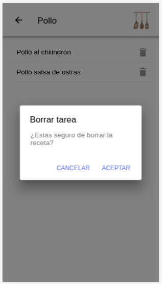

# Mi Cuisine

* Esta aplicación está hecha con ionic. En esta apllicación podras guardar tus propias recetas en tu movil para consultarlas cuando las necesites y ordenadas por categorías para poder acceder a ellas más facilmente..

* En la página inicial, es donde podemos elegir entre ir a mirar las recetas o crear una nueva, si pinchamos en nueva receta nos desplazamos a otra página.

* Aquí podrás seleccionar la categoría donde almacenar tu receta para depués localizarla, ya podemos ir rellenando los datos de nuestra receta a nuestro gusto, como el nombre, las personas para las que está indicada la cantidad de los ingredientes, los pasos a seguir para realizar la receta y otro apartado de consejos si quieres añadir algun dato más de interes cuando vallas a realizar la receta, le damos a guardar y volvemos a la página inicial.

* Después si pinchamos en recetas nos dirige a la página donde tenemos las categorías predeterminadas de la aplicación y si seleccionamos nos aparecen todas las recetas guardadas con esa categoría.

* Aquí puedes encontrar todas las recetas con esa categoría y además podras borrar cualquiera de ellas si en cualquier momento no quisieras hacer uso de ella, no se borra directamente, aparece una ventada que te pregunta si quieres borrar realmente esa receta o si te equivocas pulsas en cancelar y ya se cierra, después en la parte superior te indica en la categoría que te encuentras para que no te pierdas.

* Ya dentro de la receta seleccionada podemos visualizarla y si queremos modificarla también, eso nos redirigiría a la página de registro de receta pero con los datos de la receta que queremos editar, modificaríamos los datos y solo sería pulsar en guardar.

