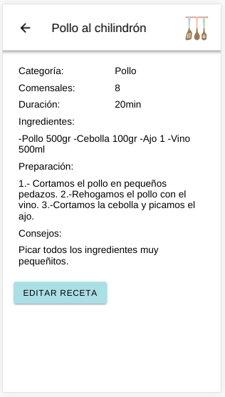

# Mi Cuisine

* Esta aplicación está hecha con ionic. En esta apllicación podrás guardar tus propias recetas en tu móvil para consultarlas cuando las necesites y ordenadas por categorías para poder acceder a ellas más fácilmente..

# Inicio

* En la página inicial, es donde podemos elegir entre ir a mirar las recetas o crear una nueva, si pinchamos en nueva receta nos desplazamos a la página de registro.

# Registro

* Aquí podrás seleccionar la categoría donde almacenar tu receta para después localizarla. Una vez aquí podemos ir rellenando los datos de nuestra receta a nuestro gusto, el nombre, las personas para las que está indicada la cantidad de los ingredientes, los pasos a seguir para realizar la receta y otro apartado de consejos si quieres añadir algún dato más de interés cuando vayas a realizar la receta, le damos a guardar y nos lleva a la página inicial.

# Categoría

* Después si pinchamos en recetas nos dirige a la página donde tenemos las categorías predeterminadas de la aplicación y si seleccionamos una, nos aparecen todas las recetas guardadas con esa categoría.

# Lista recetas

* Aquí puedes encontrar todas las recetas con esa categoría y además podrás borrar cualquiera de ellas si en cualquier momento no quisieras hacer uso de ella, no se borra directamente, aparece una ventada que te pregunta si quieres borrar realmente esa receta o si te equivocas pulsas en cancelar y ya se cierra, después en la parte superior te indica en la categoría que te encuentras para que no te pierdas.

# Receta

* Ya dentro de la receta seleccionada podemos visualizarla y si queremos modificarla, tenemos un botón para poder hacerlo, eso nos redirigiría a la página de registro de receta pero con los datos de la receta, aquí modificaríamos los datos y sólo sería pulsar en guardar y nos aparece la receta con los datos modificados.

